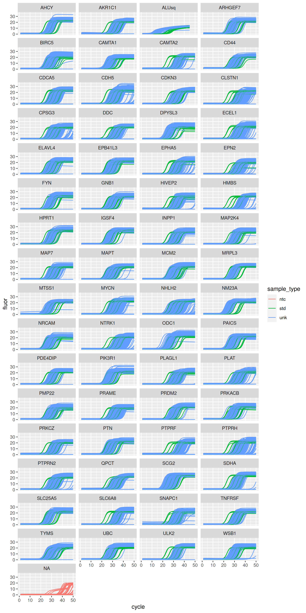

<!-- README.md is generated from README.Rmd. Please edit that file -->

# vermeulen

<!-- badges: start -->
<!-- badges: end -->

`{vermeulen}` provides the Biomarker data set by [Vermeulen et al.
(2009)](https://doi.org/10.1016/S1470-2045(09)70154-8) in tidy format.

This data set is for a real-time quantitative PCR experiment that
comprises:

-   The raw fluorescence data of 24,576 amplification curves.
-   64 targets: 59 genes of interest and 5 reference genes.
-   366 neuroblastoma cDNA samples and 18 dilution series samples.

## Installation

Install `{vermeulen}` from CRAN:

``` r
# Install from CRAN
install.packages("vermeulen")
```

You can instead install the development version of `{vermeulen}` from
GitHub:

``` r
# install.packages("remotes")
remotes::install_github("ramiromagno/vermeulen")
```

## Usage

Because of CRAN size limits the data is not provided at installation
time. The data can be retrieved from this GitHub repository after
installation with the function `ds_biomarker()`.

Alternatively, if you want only a selection of variables you may use the
following helpers:

-   `amplification_curves()`
-   `reactions()`
-   `targets()`
-   `samples()`

``` r
library(vermeulen)
library(tidyverse)

# Takes a few seconds (downloading from GitHub...)
biomarker <- as_tibble(ds_biomarker())
biomarker
#> # A tibble: 1,226,880 × 10
#>    plate well  dye   target target_type sample sample_type dilution cycle fluor
#>    <fct> <fct> <fct> <fct>  <fct>       <chr>  <fct>          <dbl> <int> <dbl>
#>  1 AHCY  A1    SYBR  AHCY   toi         1495   unk               NA     1  1.10
#>  2 AHCY  A1    SYBR  AHCY   toi         1495   unk               NA     2  1.45
#>  3 AHCY  A1    SYBR  AHCY   toi         1495   unk               NA     3  1.46
#>  4 AHCY  A1    SYBR  AHCY   toi         1495   unk               NA     4  1.47
#>  5 AHCY  A1    SYBR  AHCY   toi         1495   unk               NA     5  1.47
#>  6 AHCY  A1    SYBR  AHCY   toi         1495   unk               NA     6  1.45
#>  7 AHCY  A1    SYBR  AHCY   toi         1495   unk               NA     7  1.48
#>  8 AHCY  A1    SYBR  AHCY   toi         1495   unk               NA     8  1.46
#>  9 AHCY  A1    SYBR  AHCY   toi         1495   unk               NA     9  1.47
#> 10 AHCY  A1    SYBR  AHCY   toi         1495   unk               NA    10  1.46
#> # … with 1,226,870 more rows
#> # ℹ Use `print(n = ...)` to see more rows
```

``` r
biomarker %>%
  ggplot(mapping = aes(x = cycle, y = fluor, group = interaction(plate, well), col = sample_type)) +
  geom_line() +
  facet_wrap(vars(target), ncol = 4) +
  geom_line(size = 0.1)
```



## Code of Conduct

Please note that the `{vermeulen}` project is released with a
[Contributor Code of
Conduct](https://contributor-covenant.org/version/2/1/CODE_OF_CONDUCT.html).
By contributing to this project, you agree to abide by its terms.

## References

1.  Vermeulen et al.. *Predicting outcomes for children with
    neuroblastoma using a multigene-expression signature: a
    retrospective SIOPEN/COG/GPOH study*. The Lancet Oncology 10,
    663–671 (2009). doi:
    [10.1016/S1470-2045(09)70154-8](https://doi.org/10.1016/S1470-2045(09)70154-8).

2.  Ruijter et al.. *Evaluation of qPCR curve analysis methods for
    reliable biomarker discovery: Bias, resolution, precision, and
    implications*. Methods 59 32–46 (2013). doi:
    [10.1016/j.ymeth.2012.08.011](https://doi.org/10.1016/j.ymeth.2012.08.011).
